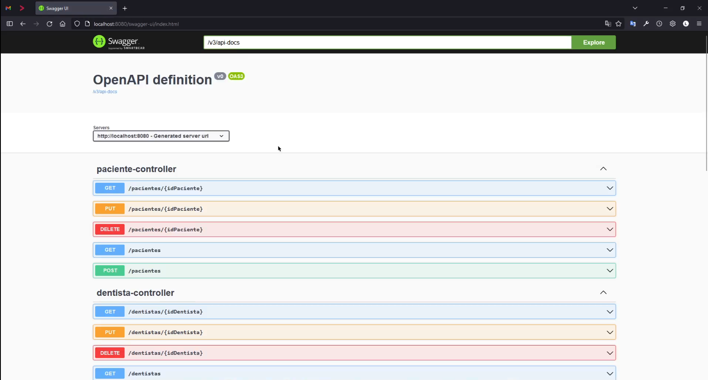
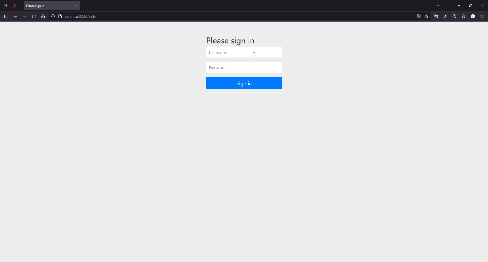
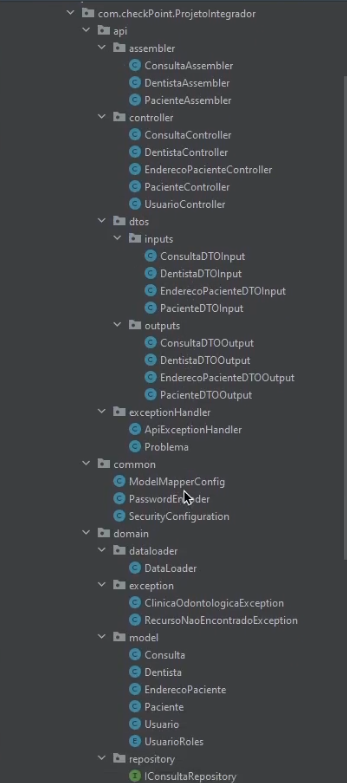
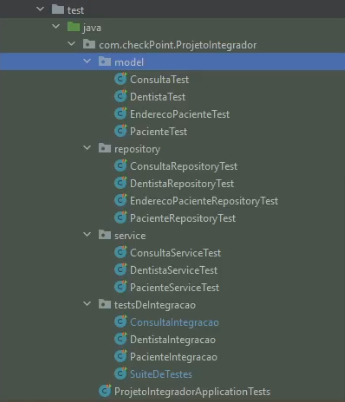

# **Checkpoint Backend One**

> 📝
> Projeto desenvolvido para avaliação da matéria Backend 1 do curso CTD - Certified Tech Developer

> ⚠️
> Tecnologias utilizadas: 
> - Java 17
> - Spring Boot 2.7.3
> - Spring Data JPA
> - Spring Boot Validation
> - Spring Boot Security
>     - Basic Auth
> - Data base H2
> - JUnit
> - Model Mapper 3.1.0
> - Swagger
> - Lombok

> ⚠️
> Metodologias utilizadas:
>  - TDD (Teste Drive Development)
>    - Testes unitários
>    - Teste de integração 
>  - Pattern MVC (Model View Controller)
>  - Pattern DAO (Data Access Object)
>  - Pattern DTO (Data Transfer Object)

` Este mini projeto tem pro premissa resolver a problemática de um possível consultório ondontológico em gerenciar seus pacientes, dentistas e suas respectivas consultas. Onde é imprescindível o respeito a algumas regras de negócios, irei citar uma: "como não termos consultas com o mesmo dentista no mesmo horário em que ele já esteja marcado em outra consulta, e isso respeitando o periódo para que a consulta possa ser finalizada para ai sim este dentista fique disponível no sistema novamente por exemplo". `

## Endpoints/recursos da API documentados pelo Swagger

## Spring security (Basic Auth)

## Estrutura de packages pensando melhor manutenção e leitura

## TDD (Test Driven Development)
